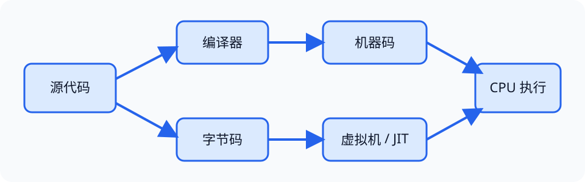

# 编程语言（Programming Language）

> 对应讲稿：`Slide03-ProgrammingLanguage-2025.pdf`（见课程 Canvas，不在公开仓库）

## 一句话定位

编程语言把人的问题求解步骤编码成机器可以执行的形式，同时提供控制复杂度的抽象。

## 学完应能做到

- 在一段小程序中找出数据、操作、控制和输入输出。
- 判断一个错误更可能属于语法、类型、运行时还是逻辑错误。
- 画出源代码经过编译器、解释器、字节码或 JIT 到机器执行的路径。

## 核心知识点

### 语言的四类成分

- **数据（data）**：数值、字符串、集合以及自定义结构。
- **操作（operation）**：算术、比较、函数和对象操作。
- **控制（control）**：顺序、分支、循环、函数调用和异常。
- **传输（communication）**：输入输出、文件、网络及模块接口。

### 语法、语义与类型

- **语法（syntax）**规定表达式怎样写；不合语法通常无法开始执行。
- **语义（semantics）**说明合法程序表示什么行为。
- **类型（type）**规定值及允许的操作；类型检查可在运行前或运行时发现不合理组合。

### 程序怎样执行

- **编译（compile）**：先翻译为目标代码，再运行；便于优化和部署。
- **解释（interpret）**：解释器读取程序并执行；交互方便。
- **混合方式**：先生成字节码（bytecode），再由虚拟机解释或即时编译（JIT）。Python 实现也常包含编译为字节码的阶段，因此“Python 只解释”并不精确。

### 范式是组织思想，不是语言标签

过程式、面向对象、函数式和声明式强调不同组织方式。一种语言可以支持多种范式；导论阶段应先理解“状态怎样改变、数据怎样流动”。

## 工程桥接

- 机械控制脚本需要明确单位、类型和异常行为，否则“数字正确”也可能造成错误动作。
- 领域特定语言（DSL）可让材料实验流程、网络配置或临床规则以更接近专业人员的方式表达。

## 常见误区与边界

- 编译语言不一定总比解释语言快；实现、优化和任务性质共同决定性能。
- 通过语法检查不等于程序正确；逻辑错误需要测试和推理发现。
- 自然语言提示不是传统程序：它通常是概率性的，关联见 [21 大语言模型](21-llm.md)。

## 主动学习与考核迁移

1. 不运行代码，预测 `x = 3; x = x + 2` 每一步的状态变化。
2. 分别给出语法错误、类型错误和逻辑错误的最小例子。
3. 比较“编译后再运行”和“每次解释执行”在嵌入式设备部署中的权衡。

## 延伸阅读

- [09 计算机系统与架构](09-computer-system-arch.md)
- [21 大语言模型](21-llm.md)
