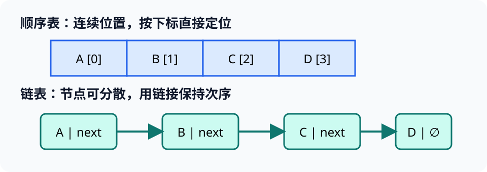

# 数据结构基础：线性表（Linear List）

> 对应讲稿：`Slide04-DataStructure-2025.pdf`（见课程 Canvas，不在公开仓库）

## 一句话定位

数据结构研究“数据元素之间有什么关系”以及“这些关系怎样存进计算机”；同一个线性关系可以有不同存储实现。

## 学完应能做到

- 区分逻辑结构、存储结构和对数据的操作。
- 手工追踪顺序表与链表的插入、删除和访问。
- 根据随机访问、插删频率和内存布局选择表示。

## 核心知识点

### 数据结构的三个侧面

1. **逻辑结构**：元素之间的关系，如线性、树形和图状关系。
2. **存储结构**：这些元素和关系怎样放入内存。
3. **操作**：访问、查找、插入、删除和更新。

### 线性表与两种存储

线性表（linear list）中的元素按顺序排列；除首尾外，每个元素有唯一前驱和后继。顺序表使用连续内存，按下标访问快，中间插删通常要移动元素。链表（linked list）的节点保存数据和链接，找到位置后改链接方便，但访问第 `i` 项通常要从头走。



| 操作 | 顺序表 | 单链表 |
|---|---|---|
| 已知下标访问 | 通常 $O(1)$ | 通常 $O(n)$ |
| 在已知节点后插入 | 可能移动元素 | 修改少量链接 |
| 空间局部性 | 好 | 通常较弱 |
| 额外空间 | 少 | 需要链接字段 |

## 工程桥接

- 有限元网格节点按编号频繁随机访问时，连续数组通常更合适。
- 动态事件链经常插入和删除时，链式结构更自然；实际工程仍需考虑缓存、内存分配和并发。

## 常见误区与边界

- “数组就是线性表”：数组是存储方式，线性表是逻辑关系。
- “链表插入一定 $O(1)$”：只有已经拿到插入位置的节点时才成立；寻找位置仍可能是 $O(n)$。
- Python `list` 是动态数组，不是链表。

## 最小代码观察

```python
values = [10, 20, 30, 40]
values.insert(1, 15)
values.pop(3)
print(values)
```

完整示例：[04_linear_list.py](../../code/examples/04_linear_list.py)。

## 主动学习与考核迁移

1. 画出在 `[A,B,C,D]` 的位置 2 插入 `X` 时，顺序表发生的移动。
2. 给出单链表完成相同操作时需要改变的链接。
3. 为“实时传感器最近 1000 个采样值”选择结构，并说明访问与淘汰需求。

## 延伸阅读

- [05 典型数据结构与算法](05-data-structure-advanced.md)
- [实验 01：数据结构](../../code/labs/lab-01-structures/README.md)
