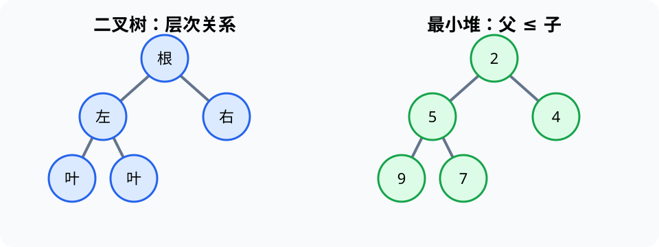
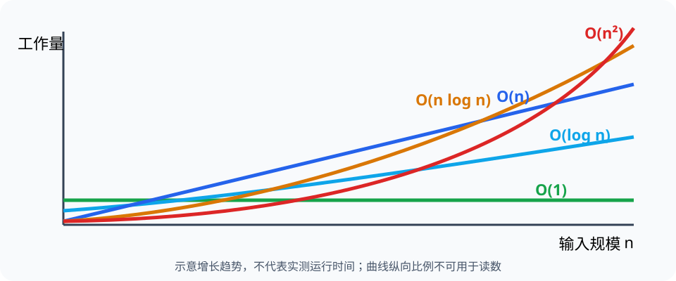

# 典型数据结构与算法（Data Structures and Algorithms）

> 对应讲稿：`Slide05-DataStructure2-2025.pdf`（见课程 Canvas，不在公开仓库）

> 图谱说明：本页保留讲稿全景。按概念学习请分别进入 [`stack-queue`](stack-queue.md)、[`trees-heaps`](trees-heaps.md)、[`ext-recursion-divide-conquer`](ext-recursion-divide-conquer.md) 与 [`algorithm-strategies`](algorithm-strategies.md)。

## 一句话定位

栈、队列、树和堆通过限制访问方式换取清晰语义与高效操作；复杂度描述算法随输入规模增长的资源需求。

## 学完应能做到

- 根据“后进先出、先进先出、层次关系、按优先级取出”选择结构。
- 手工追踪表达式栈、递归调用栈、循环队列和二叉堆调整。
- 比较 $O(1)$、$O(\log n)$、$O(n)$、$O(n\log n)$、$O(n^2)$ 的增长趋势。

## 核心知识点

### 栈、递归与表达式

栈（stack）只在栈顶插入和删除，遵循后进先出（LIFO）。函数调用会把局部状态压入调用栈；递归需要把问题缩小并设置终止条件。

### 队列与循环队列

队列（queue）从队尾加入、从队首取出，遵循先进先出（FIFO）。循环队列用取模让固定数组首尾相接，避免出队后反复移动元素。


### 树、二叉查找树与堆

树（tree）表示层次关系。二叉查找树用有序关系支持查找，但失衡时会退化。优先队列每次取最高优先级元素；二叉堆用完全二叉树和堆序性质实现，插入与删除堆顶通常为 $O(\log n)$。



### 算法与复杂度

算法是有限、明确、可执行的步骤。$O$ 描述渐近上界，$\Omega$ 描述渐近下界，$\Theta$ 描述同阶紧确界。导论阶段先会比较增长率，再理解形式定义。



## 工程桥接

- 实时任务进入就绪队列；紧急告警可用优先队列先处理。
- 装配体、文件系统和组织结构天然具有树形层次。
- 递归适合树遍历和分治，但深度过大可能耗尽调用栈。

## 常见误区与边界

- Python 列表 `pop(0)` 会移动后续元素；高效队列使用 `collections.deque`。
- 堆只保证父子之间的堆序，不保证整个数组完全有序。
- 大 O 不代表精确时间；输入分布、常数、缓存和实现仍影响性能。
- 搜索与哈希见 [扩展卡片](ext-search-hashing.md)，不属于本讲主线。

## 最小代码观察

```python
from collections import deque

waiting = deque(["A", "B"])
waiting.append("C")
print(waiting.popleft())  # A
```

完整示例：[05_structures.py](../../code/examples/05_structures.py)。

## 主动学习与考核迁移

1. 画出计算 `3 * (4 + 5)` 时操作数栈和运算符栈的变化。
2. 追踪 `Hanoi(3)` 的调用树，指出终止条件。
3. 在堆 `[2,5,4,9,7]` 中插入 `1`，画出上浮过程。
4. 输入扩大 100 倍时，比较 $O(n)$ 与 $O(n^2)$ 工作量的倍率。

## 延伸阅读

- [实验 01：数据结构](../../code/labs/lab-01-structures/README.md)
- [交互可视化说明](../../code/visualizations/README.md)
