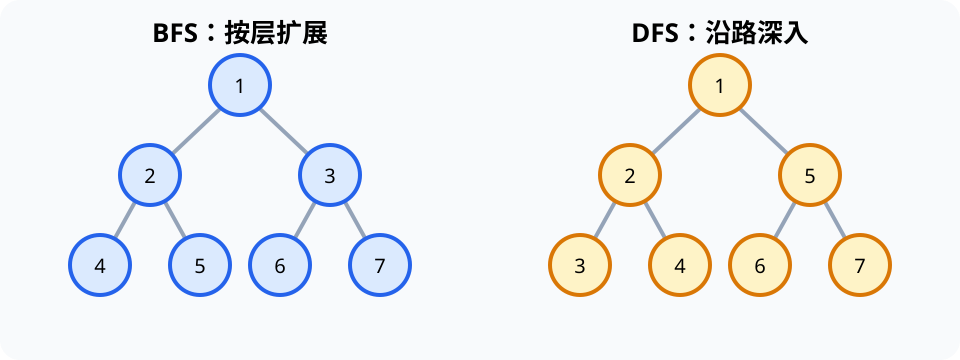

# 图的探索（Graph Exploration）

> 对应讲稿：`Slide06-GraphExploration-2025.pdf`（见课程 Canvas，不在公开仓库）

## 一句话定位

图（graph）用顶点表示对象、用边表示关系；遍历是在不遗漏也不无谓重复的前提下系统探索网络。

## 学完应能做到

- 区分有向/无向、加权/无权、子图、路径、连通和生成树。
- 把一个小图写成邻接表或邻接矩阵。
- 手工追踪 BFS 与 DFS，并说明访问次序为何可能不唯一。

## 核心知识点

图写作 $G=(V,E)$。树是连通无环图；生成树（spanning tree）包含原图全部顶点且保持连通但不含环。子图只使用原图中的部分顶点和边。

- 邻接表只记录存在的邻居，适合稀疏图。
- 邻接矩阵用 $n\times n$ 矩阵表示边，检查一条边直接，也便于线性代数分析。
- BFS 使用队列逐层扩展，在无权图中给出最少边数路径。
- DFS 使用递归或显式栈，沿一路深入后回退，适合发现连通分量、环和依赖结构。

遍历顺序受邻居排列影响，因此程序应固定邻居顺序，示例输出才可重复。

## 工程桥接

- 船舶航路、轨道交通和通信网络可建模为加权图。
- 分子图中顶点是原子、边是化学键；蛋白相互作用构成生物网络。
- 机械装配依赖或课程先修关系常用有向图表示。

## 常见误区与边界

- BFS 不自动解决加权最短路径；非负权图见 [07 Dijkstra](07-greedy-algorithm.md)。
- “遍历次序不同”不一定错误，应检查是否满足算法规则。
- 图模型只保留所选关系；没有进入图的数据不会被算法考虑。

完整示例：[06_graph_bfs_dfs.py](../../code/examples/06_graph_bfs_dfs.py)。

## 主动学习与考核迁移

1. 对同一个 6 顶点图分别给出 BFS 和 DFS 次序，并写明邻居访问顺序。
2. 从 BFS 的父节点关系中画出一棵生成树。
3. 将“实验设备之间的数据依赖”建模为图，说明边是否有向、是否加权。

## 延伸阅读

- [实验 02：图探索](../../code/labs/lab-02-graph/README.md)
