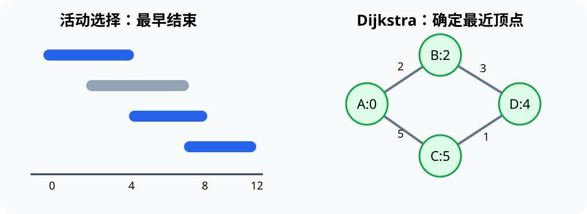

# 贪心算法（Greedy Algorithm）

> 对应讲稿：`Slide07-GreedyAlgorithm-2025.pdf`（见课程 Canvas，不在公开仓库）

## 一句话定位

贪心算法每一步选择当前最有利且可行的方案；它高效，但必须说明为什么局部选择不会破坏全局最优。

## 学完应能做到

- 从候选集合、可行性检查和选择规则描述一个贪心算法。
- 为错误的贪心规则构造最小反例。
- 追踪活动调度、分数背包和 Dijkstra 的关键状态。

## 核心知识点

### 活动调度与背包

要选择最多个互不重叠活动，按结束时间排序并反复选择最早结束的可行活动。物品可拆分的分数背包按单位价值贪心正确；0/1 背包中物品不可拆分，相同规则可能失败。

### Dijkstra 最短路径

对边权非负的图，Dijkstra 每次确定当前距离最小的未处理顶点，再松弛（relax）相邻边。出现负权边时，“已确定距离不会再变”的依据失效。

## 工程桥接

- 实验设备预约可转化为活动调度，但“最多任务”和“最大总价值”是不同目标。
- 航线或物流路径可用 Dijkstra，但权重必须表示可相加且非负的成本。
- 制造调度等真实问题常含多约束，简单贪心可作基线，不应自动视为最优。

## 常见误区与边界

- “每步选最大/最小”不是充分理由；必须明确候选、约束和目标。
- `[1,3,4]` 凑 6 时，先取最大面额得到 3 枚，不是最优的 2 枚。
- Dijkstra 不是 BFS；只有所有边权相同或可忽略时才退化为按层扩展。

完整示例：[07_greedy_dijkstra.py](../../code/examples/07_greedy_dijkstra.py)。

## 主动学习与考核迁移

1. 构造一个“按开始最早选择”活动会失败的最小例子。
2. 比较分数背包与 0/1 背包，指出哪个约束使贪心失效。
3. 给一张含负权边的小图，说明 Dijkstra 的哪一步失去保证。

## 延伸阅读

- [实验 03：贪心与最短路径](../../code/labs/lab-03-greedy/README.md)
