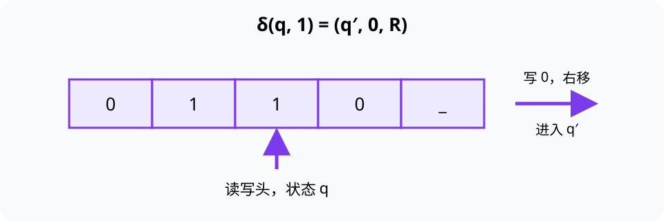

# 图灵机（Turing Machine）

> 对应讲稿：`Slide08-TuringMachine-2025.pdf`（见课程 Canvas，不在公开仓库）

## 一句话定位

图灵机用极少的部件精确定义“按规则计算”是什么意思，是分析算法能力而不是制造真实计算机的理论模型。

## 学完应能做到

- 指出纸带、读写头、符号表、状态集合、转移规则和停机状态。
- 给定输入与转移表，逐步写出状态、纸带和读写头位置。
- 解释多带图灵机为何更方便但不扩展“哪些问题可计算”。

## 核心知识点

一次转移由“当前状态 + 当前符号”决定三件事：写什么、向左还是向右移动、进入哪个状态。可写作：

$$
\delta(q, a) = (q', b, D), \quad D\in\{L,R\}.
$$

图灵机的**配置（configuration）**由当前状态、非空白纸带内容和读写头位置共同确定。执行轨迹就是配置序列；没有匹配规则或进入停机状态时结束。

多带图灵机可以在多条纸带上工作，程序更容易写，但单带图灵机可以模拟它，只是可能更慢。这说明“方便程度”和“可计算能力”不同。

## 计算边界

丘奇-图灵论题表达一个广泛接受的观点：任何机械化、有效可执行的计算过程都可由图灵机模拟。停机问题说明存在无法用通用算法判定的任务；它是本讲的边界提醒，不要求在卡片中展开形式证明。

## 工程桥接

- 状态机广泛用于协议、控制器和嵌入式系统；与图灵机都强调状态和转移，但状态机通常没有无限纸带。
- 证明一个程序会终止，与控制系统证明不会进入危险状态，都体现对行为边界的关注。

## 常见误区与边界

- 普通 Python 循环不是“图灵机模拟器”；模拟器必须显式维护转移表、状态、纸带和读写头。
- “理论上可计算”不等于在现实时间和内存内可完成。
- 哥德尔不完备定理与停机问题有思想关联，但不能简单称为“同构”。

完整示例：[08_turing_machine.py](../../code/examples/08_turing_machine.py)。

## 主动学习与考核迁移

1. 给定三条转移规则，手工执行 5 步并记录完整配置。
2. 设计一台把输入中所有 `1` 改为 `0` 后停机的图灵机。
3. 解释“多带更快”为什么不等于“多带能算单带不能算的问题”。

## 延伸阅读

- [实验 04：图灵机](../../code/labs/lab-04-turing-machine/README.md)
- [图灵机交互可视化](../../code/visualizations/TuringMachine.html)
