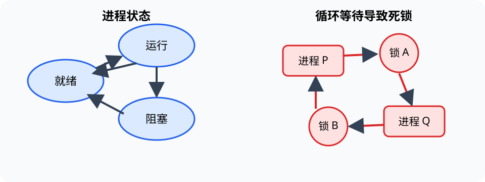

# 计算机组成与操作系统（Computer Architecture and Operating System）

> 对应讲稿：`Slide09-ComputerSystemAndArchitecture-2025.pdf`（见课程 Canvas，不在公开仓库）

## 一句话定位

体系结构规定程序怎样由硬件执行；操作系统（operating system, OS）在硬件与应用之间管理处理器、内存、设备和文件，并提供稳定接口。

## 学完应能做到

- 说明 CPU、存储器、输入输出和指令集怎样协作执行程序。
- 比较寄存器、缓存、内存和外存的速度、容量与成本。
- 追踪进程状态、轮转调度、临界区竞争和简单死锁。

## 计算机组成

冯诺依曼结构把程序和数据存入存储器；CPU 中的运算器、寄存器和控制器按指令集（instruction set architecture, ISA）解释机器指令。典型指令经历取指、译码、执行、访存和写回。

存储层次用“小而快”到“大而慢”的多级结构缓解速度与容量矛盾。缓存有效依赖时间局部性和空间局部性。

## 操作系统

### 进程、线程与状态

程序是静态代码，进程（process）是一次运行及其资源，线程（thread）是进程中的执行流。进程在就绪、运行、阻塞等状态间转换。

### 调度、同步与死锁

- 调度器选择下一个使用 CPU 的进程；轮转（round robin）按时间片循环。
- 并发访问共享数据会产生竞争条件；临界区需要互斥锁等同步机制。
- 多个执行单元彼此等待资源可能死锁；可通过预防、避免、检测或恢复处理。

### 其他资源

操作系统还负责虚拟内存与保护、设备抽象、文件系统、用户接口及网络服务。

## 工程桥接

- CFD、有限元和 AI 训练依赖 CPU/GPU、存储与并行数据流的共同设计。
- 飞控、机器人和工业控制不仅要求平均性能，还要求实时性、隔离和故障可控。

## 常见误区与边界

- 图灵机是计算模型，不是现代 CPU 的部件清单。
- 进程不等于程序文件；同一程序可以有多个进程。
- 加锁不是越多越安全：锁顺序错误可能导致死锁，锁粒度过大降低并行度。

## 主动学习与考核迁移

1. 追踪一条 `LOAD-ADD-STORE` 指令序列的数据位置变化。
2. 给出一个进程从运行转阻塞、再转就绪的真实事件。
3. 对两个进程的 `count += 1` 分解读、改、写步骤，构造丢失更新。
4. 画出两把锁导致循环等待的资源图。

## 延伸阅读

- [10 软件工程](10-software-engineering.md)
- [11 计算机网络](11-computer-network.md)
