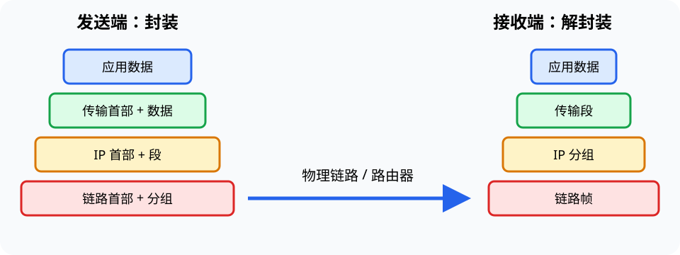

# 计算机网络（Computer Network）

> 对应讲稿：`Slide11-ComputerNetwork-2025.pdf`（见课程 Canvas，不在公开仓库）

## 一句话定位

计算机网络让端系统通过接入网和核心网交换数据；分层把复杂通信拆成可替换、可组合的协议服务。

## 学完应能做到

- 描述数据从一个应用经过主机、接入链路、路由器到另一应用的路径。
- 在应用、传输、网络、链路和物理层之间追踪封装与解封装。
- 区分带宽、时延、吞吐、丢包和可靠性。

## 核心知识点

- **网络边缘**：运行应用的主机、服务器、传感器和移动终端。
- **接入网**：把终端连接到网络，如以太网、Wi-Fi、蜂窝网络。
- **网络核心**：路由器按目的地址逐跳转发分组。
- **协议分层**：每层向上提供服务，并在发送时添加本层控制信息。

TCP/IP 常用五层模型：应用层、传输层、网络层、链路层、物理层。OSI 七层模型有助于讨论概念，但学习重点是每层职责和接口，不是只背层名。

IoT、无线传感器网络（WSN）、RFID 和 5G 把大量物理设备接入网络，同时引入能耗、实时性、移动性和安全约束。

## 工程桥接

- 船舶、工厂和实验室传感网络需要在覆盖、能耗、时延和可靠性间权衡。
- 远程操控关注往返时延和抖动；大规模科学数据传输更关注持续吞吐。

## 常见误区与边界

- 带宽大不保证单次响应快，传播、排队和处理时延仍存在。
- HTTP 是应用层协议，IP 负责跨网络寻址与转发，二者不能互换。
- “能联网”不等于“安全联网”，关联见 [12 信息安全](12-information-security.md)。

## 主动学习与考核迁移

1. 追踪一次浏览器请求在每层添加和移除的信息。
2. 为海上传感器选择有线、短距无线或蜂窝接入，并说明约束。
3. 判断视频卡顿更可能由低带宽、高时延还是丢包造成，并说明还需什么证据。

## 延伸阅读

- [12 信息安全](12-information-security.md)
