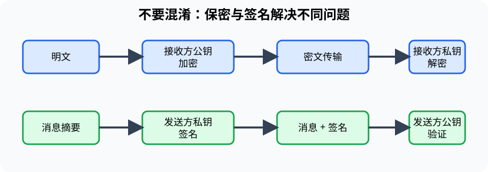

# 信息安全与密码学（Information Security and Cryptography）

> 对应讲稿：`Slide12-InformationSecurity-2025.pdf`（见课程 Canvas，不在公开仓库）

## 一句话定位

信息安全先识别资产、威胁和风险，再组合技术与管理措施保护机密性、完整性和可用性。

## 学完应能做到

- 用 CIA 三元组分析一个系统最重要的安全目标。
- 区分对称加密、公钥加密、哈希和数字签名解决的问题。
- 识别恶意软件、钓鱼、弱口令和内部误操作等不同威胁。

## 核心知识点

### 安全目标与威胁模型

- **机密性（confidentiality）**：未授权者不能读取。
- **完整性（integrity）**：数据和操作未被未授权篡改。
- **可用性（availability）**：授权者在需要时能使用服务。

威胁模型至少回答：保护什么、对手能做什么、系统信任谁、失败后果是什么。

### 密码学工具

- 对称加密使用共享密钥，速度快但密钥分发困难。
- 公钥加密使用公钥/私钥对，便于开放环境中的密钥协商和身份机制。
- 哈希把任意长度输入映射为固定长度摘要，用于完整性检查，不能“解密”。
- 数字签名用私钥签名、公钥验证，提供来源认证和完整性证据。

### 非技术攻击同样重要

恶意软件利用程序漏洞或诱导执行；社会工程利用人的信任和流程弱点。法律、组织制度、最小权限、备份和应急响应都是安全体系的一部分。

## 工程桥接

- 工业控制系统更重视可用性和安全停机，不能简单照搬普通办公网络策略。
- 医疗和基因数据需要长期隐私保护；匿名化并不自动保证无法重新识别。

## 常见误区与边界

- 加密不能自动保证数据来源真实；签名也不能保证签名者的判断正确。
- 哈希不是加密，也不应使用普通哈希直接保存密码。
- 系统安全取决于最弱环节，不能只购买一种“安全产品”。

## 主动学习与考核迁移

1. 分析实验室仪器远程控制的 CIA 优先级。
2. 判断“公开下载文件后验证未被篡改”需要哈希、加密还是签名。
3. 为一次钓鱼邮件攻击画出资产、入口、影响和缓解措施。

## 延伸阅读

- [量子计算专题](../deep/quantum-computing.md)
