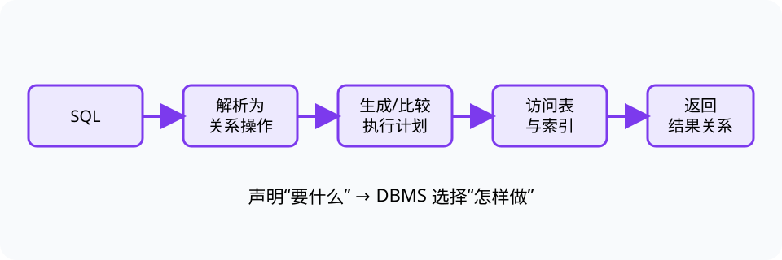

# 数据库（Database）

> 对应讲稿：`Slide13-Database-2025.pdf`（见课程 Canvas，不在公开仓库）

## 一句话定位

数据库管理系统（DBMS）把共享数据的结构、查询、约束、存储和并发管理集中起来，使应用不必各自重复处理。

## 学完应能做到

- 为一个小场景设计关系、属性、主键和外键。
- 用选择、投影、连接表达查询，并写出对应的基础 SQL。
- 解释查询解析、优化和执行的大致流程。

## 核心知识点

### 关系模型与键

关系可看作元组集合，表格是常见表示。主键唯一标识元组；外键引用另一关系的主键，表达跨表联系并支持参照完整性。

### 关系代数与 SQL

- 选择（selection）筛选行。
- 投影（projection）选择列。
- 连接（join）按条件组合关系。
- SQL 是声明式语言：用户说明要什么，DBMS 决定怎样执行。

### DBMS 内部

查询处理器解析 SQL、生成候选执行计划并估计成本；存储管理器负责页、索引、缓冲和文件。事务、ACID、索引和 NoSQL 是重要工程扩展，但本讲先掌握关系模型与查询过程。

## 工程桥接

- 材料实验数据库可把样品、制备条件、测量和设备拆成关系，通过键保持可追溯性。
- 传感器时序数据量大且写入频繁，关系数据库不一定是唯一选择；应从查询和一致性需求出发。

## 常见误区与边界

- 表格文件不等于数据库；DBMS 还提供查询、约束、并发和恢复。
- 外键不是“重复数据”，而是受约束的引用。
- SQL 返回结果的顺序若没有 `ORDER BY`，不应依赖其偶然排列。

完整示例：[13_database.py](../../code/examples/13_database.py)。

## 主动学习与考核迁移

1. 为“学生-课程-选课”设计三个关系并标注主外键。
2. 将“找出参加过设备 A 实验的样品编号”分解为选择、连接和投影。
3. 解释为什么两个等价 SQL 查询可能有不同执行时间。

## 延伸阅读

- [实验 05：数据库](../../code/labs/lab-05-database/README.md)
