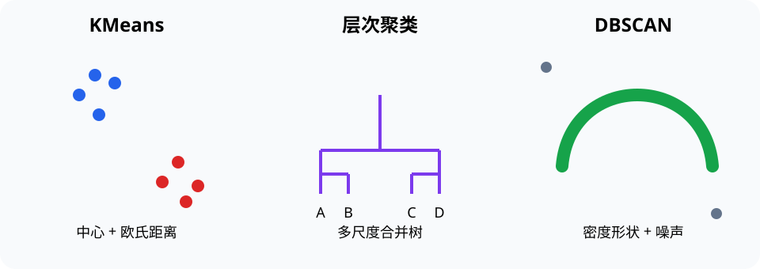

# 数据挖掘（Data Mining）

> 对应讲稿：`Slide14-DataMining-2025.pdf`（见课程 Canvas，不在公开仓库）

## 一句话定位

数据挖掘从规模较大的数据中发现可解释、可验证且对任务有用的模式；算法之前的数据理解和准备往往决定结果质量。

## 学完应能做到

- 区分类别、数值、序数和时序等数据，并选择基本预处理。
- 判断问题属于关联发现、聚类还是分类。
- 比较 KMeans、层次聚类、DBSCAN 和决策树的适用条件。

## 核心知识点

### 数据准备

检查缺失值、重复、异常、量纲和采样偏差。距离型算法对尺度敏感，温度与压力等不同量纲直接混用会扭曲结果。

### 三类任务

- **关联分析**：发现经常共同出现的项，需同时考虑支持度与置信度，避免把偶然共现当因果。
- **聚类**：没有标签时按相似性分组。KMeans 偏好近似球形簇；层次聚类给出多尺度结构；DBSCAN 能发现非球形簇和噪声。
- **分类**：从带标签样本学习决策规则；决策树用特征条件逐步划分，直观但可能过拟合。

### 评价与解释

没有标签时可结合轮廓系数、稳定性和领域意义；有标签时使用留出数据评估。聚类编号本身没有语义，`cluster 0` 和 `cluster 1` 可交换。

## 工程桥接

- 材料信息学可对成分与性能聚类，但必须先处理量纲和实验批次差异。
- 设备预测维护可从振动特征发现异常簇；聚类只能提示结构，不能自动证明故障原因。

## 常见误区与边界

- 数据挖掘不是“把算法跑一遍”；问题定义、数据质量和结果验证同样重要。
- KMeans 的 `k` 需要选择，随机初始化会影响结果，应固定随机种子并检查稳定性。
- 相关或关联不等于因果。

完整示例：[14_clustering.py](../../code/examples/14_clustering.py)。

## 主动学习与考核迁移

1. 判断“购物篮共现”“未知样品分组”“故障类型预测”分别属于哪类任务。
2. 解释为什么经纬度、温度和功率直接放入欧氏距离可能不合理。
3. 为含噪声的月牙形数据选择 KMeans 或 DBSCAN，并说明理由。

## 延伸阅读

- [实验 06：聚类](../../code/labs/lab-06-clustering/README.md)
