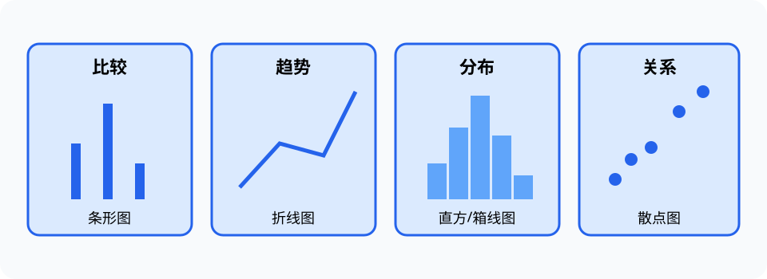

# 数据可视化（Data Visualization）

> 对应讲稿：`Slide15-DataVisualization-2025.pdf`（见课程 Canvas，不在公开仓库）

## 一句话定位

数据可视化把数据编码为位置、长度、颜色和形状，帮助人比较、发现结构并交流结论；图形必须服务问题而不是装饰。

## 学完应能做到

- 根据比较、分布、关系、组成、时序和空间任务选择图表。
- 解释位置、长度、面积和颜色等视觉编码的准确度差异。
- 识别截断坐标轴、面积误导、过度平滑和不确定性缺失。

## 核心知识点

- 类别比较常用条形图；连续分布用直方图、箱线图或密度图。
- 两变量关系可用散点图；时间变化通常用折线图；空间场用地图、等值线或热图。
- 探索性数据分析（EDA）用于发现问题和提出假设，不能把偶然图形直接当最终结论。
- 位置通常比面积和颜色更容易精确比较；颜色还需考虑色盲、打印和背景。
- 误差条、置信区间、样本量和数据缺失应在需要时可见。

## 工程桥接

- CFD 流场需要同时表达空间、方向、大小和时间，往往组合等值线、矢量场和动画。
- 材料实验图应保留重复测量与误差，避免只展示一条“漂亮曲线”。
- 医学图像配色会影响病灶感知，必须避免把显示增强误认为原始测量。

## 常见误区与边界

- 三维图不一定比二维图信息更多，透视和遮挡可能降低可读性。
- 相关趋势不能替代统计检验或因果设计。
- “从零开始坐标轴”不是绝对规则，但截断必须明确且不能夸大差异。

完整示例：[15_visualization.py](../../code/examples/15_visualization.py)。

## 主动学习与考核迁移

1. 为同一份温度数据分别回答“趋势”“分布”“异常值”，各选择一种图。
2. 找出一张截断坐标轴图可能造成的错误判断，并重新设计。
3. 为有 5 次重复测量的材料强度实验设计同时展示中心与波动的图。

## 延伸阅读

- Cairo, A. (2016). *The Truthful Art*.
