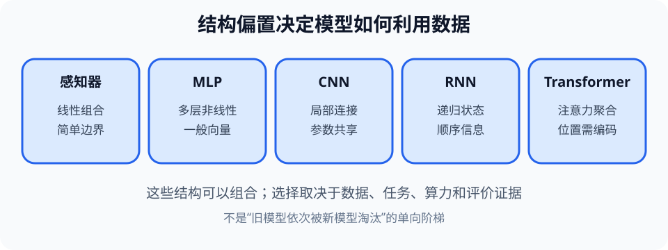

# 机器学习与神经网络（Machine Learning and Neural Networks）

> 对应讲稿：`Slide17-MachineLearning-2025.pdf`（见课程 Canvas，不在公开仓库）

> 图谱说明：本页保留机器学习全景。泛化、指标、数据泄漏与漂移见 [`ml-evaluation`](ml-evaluation.md)，网络结构原理见 [`neural-networks-transformers`](neural-networks-transformers.md)。

## 一句话定位

机器学习从样本归纳模型并在未见数据上作出预测；神经网络通过多层可学习变换形成适合不同数据结构的表示。

## 学完应能做到

- 区分监督、无监督、半监督、自监督和强化学习的反馈来源。
- 追踪感知器计算，解释 XOR 为什么需要非线性或多层结构。
- 比较 MLP、CNN、RNN 和 Transformer 适合的数据与结构假设。

## 学习与泛化

监督学习从带标签样本学习输入到输出；无监督学习寻找未标注数据结构。训练、验证和测试数据承担不同角色。目标是泛化（generalization），而不是记住训练样本；训练误差低但新数据误差高是过拟合。

## 从感知器到深度网络

感知器先计算加权和再通过激活函数。单个线性边界不能表示 XOR；多层感知机（MLP）组合多个神经元，并借非线性激活形成复杂边界。

- CNN 使用局部连接和参数共享，适合图像空间结构。
- RNN 用隐藏状态传递过去信息，适合序列。
- Transformer 用注意力直接建模序列位置间关系，并行性更好。

训练通过损失函数评价预测，并用梯度下降和反向传播更新参数。导论重点是“误差怎样反馈到参数”，不要求完整矩阵推导。

## 工程桥接

- 设备预测维护必须按设备或时间划分测试集，否则相邻采样泄漏会夸大泛化能力。
- 材料性质预测中样本少、实验批次不同，应报告不确定性并验证分布偏移。

## 常见误区与边界

- 模型参数更多不自动更好；数据、结构偏置、训练和评价共同决定结果。
- 激活函数提供非线性；多层纯线性变换仍等价于一层线性变换。
- 准确率在类别极不平衡时可能误导，指标应匹配实际错误成本。

完整示例：[17_generalization.py](../../code/examples/17_generalization.py)。

## 主动学习与考核迁移

1. 手算一个二输入感知器的加权和与输出。
2. 用图解释为什么一条直线不能分开 XOR 四个点。
3. 为图像、语音和一组无序测量分别选择模型结构并说明理由。
4. 比较训练误差和测试误差，判断欠拟合、适当拟合或过拟合。

## 延伸阅读

- [实验 07：泛化](../../code/labs/lab-07-machine-learning/README.md)
