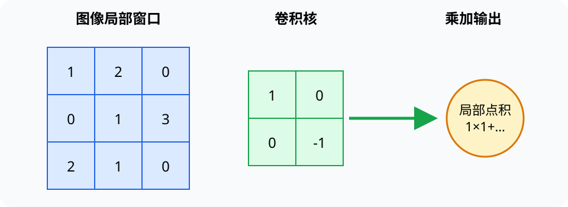

# 计算机视觉（Computer Vision）

> 对应讲稿：`Slide18-ComputerVision-2025.pdf`（见课程 Canvas，不在公开仓库）

## 一句话定位

计算机视觉从光学成像和数字像素中恢复对对象、位置和场景的有用描述；输入质量和成像过程会直接影响模型。

## 学完应能做到

- 说明场景经光学系统、传感器、采样和量化成为数字图像。
- 手工计算一个小卷积核在局部图像上的输出。
- 区分分类、检测、分割和跟踪任务。

## 核心知识点

数字图像是像素数组；灰度图每个像素一个强度，彩色图通常有多个通道。模糊、噪声、曝光和设备差异都来自采集链路。

滤波用局部邻域改变图像，可平滑噪声或突出边缘。卷积神经网络把卷积核变成可学习参数，利用局部连接与参数共享逐层提取特征。

- 分类：整张图属于什么类别。
- 检测：有哪些对象、位置在哪里。
- 分割：每个像素属于什么区域。
- 跟踪：对象随时间怎样移动。

评价必须匹配任务，并检查设备、人群、光照和场景分布变化。

## 工程桥接

- 工业机器视觉检测表面缺陷，需要把照明、相机标定和模型作为整体设计。
- 遥感影像关注尺度、波段和地理配准；医学影像受成像物理和设备协议影响。

## 常见误区与边界

- CNN 看到的是数值阵列，不天然理解对象语义。
- 图像增强可能改善显示但改变测量；科研和医疗场景需保留处理记录。
- 在同一设备数据上高准确率不保证跨设备有效。

## 主动学习与考核迁移

1. 手算 $2\times2$ 卷积核在一个 $3\times3$ 图像上的四个输出。
2. 判断道路车辆计数需要分类、检测、分割还是跟踪。
3. 列出工业缺陷模型从实验室到生产线可能遇到的三种分布变化。

## 延伸阅读

- [计算机视觉前沿](../frontier/cv-frontier.md)
