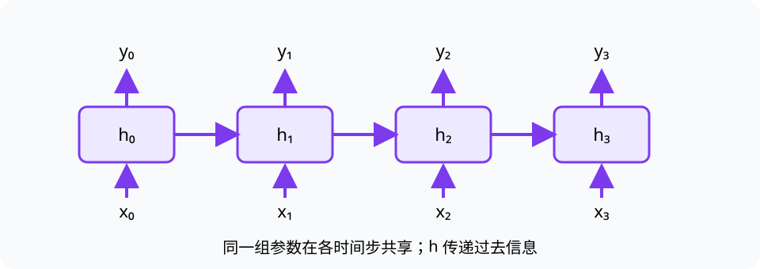

# 语音识别与序列建模（Speech Recognition and Sequence Modeling）

> 对应讲稿：`Slide20-SpeechRecognition-2025.pdf`（见课程 Canvas，不在公开仓库）

## 一句话定位

自动语音识别（ASR）把随时间变化的语音特征映射为文字序列；RNN 用隐藏状态把过去信息带到当前计算。

## 学完应能做到

- 解释波形如何经过分帧和特征表示成为序列输入。
- 展开一个小 RNN，追踪隐藏状态与输出。
- 根据删除、插入和替换错误计算词错误率（WER）。

## 核心知识点

语音长度可变，时刻之间相关。端到端模型直接学习“语音特征序列 → 文字序列”，输出端用真实标签训练。

RNN 在时间步 $t$ 结合当前输入 $x_t$ 和上一状态 $h_{t-1}$：

$$
h_t=g(W_xx_t+W_hh_{t-1}+b),\qquad y_t=W_yh_t.
$$

经典系统曾分别训练声学模型、语言模型和解码器；本讲以端到端模型和 RNN 机制为主，经典流程作为历史对照。

词错误率：

$$
WER=\frac{S+D+I}{N},
$$

其中 $S,D,I$ 分别是替换、删除和插入数，$N$ 是参考词数。

## 工程桥接

- 车载和工业语音控制要面对噪声、回声、实时性和专有词汇。
- 医疗口述需保护隐私并验证专业术语；低 WER 仍可能在关键药名上出错。

## 常见误区与边界

- RNN 的隐藏状态是压缩的历史信息，不是完整录音存储。
- WER 平均值不能反映所有错误严重程度。
- 不使用“多数场景已接近人类”这类无条件结论；口音、噪声和专业领域差异很大。

## 主动学习与考核迁移

1. 画出长度为 4 的 RNN 展开图，标出参数共享。
2. 参考文本 8 个词，出现 1 次删除、1 次替换，计算 WER。
3. 分析车间 ASR 从安静实验室部署到现场时的输入分布变化。

## 延伸阅读

- [21 大语言模型](21-llm.md)
