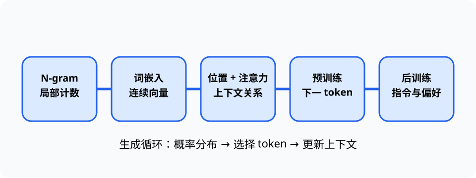

# 大语言模型（Large Language Model, LLM）

> 对应讲稿：`Slide21-LLM-2025.pdf`（见课程 Canvas，不在公开仓库）

> 图谱说明：本页聚焦语言模型演进。RAG、引用、工具调用和 Agent 编排见 [`rag-tool-agents`](rag-tool-agents.md)，权限边界见 [`ai-security`](ai-security.md)，部署与问责见 [`responsible-ai-systems`](responsible-ai-systems.md)。

## 一句话定位

语言模型估计文本序列的概率；大语言模型用神经网络、预训练和后训练把下一 token 预测扩展为可通过自然语言交互的通用能力。

## 学完应能做到

- 用计数估计简单 N-gram 条件概率，并说明稀疏性问题。
- 解释 token、词嵌入、位置编码、自注意力和自回归生成的作用。
- 区分预训练、监督微调和偏好优化，并分析幻觉、算力与治理挑战。

## 从统计语言模型到预训练模型

N-gram 假设当前词只依赖前面有限个词，容易计数但上下文短、未见组合多。神经语言模型把离散 token 映射为连续词嵌入（embedding），相似用法可以共享统计信息。

Transformer 加入位置编码表示顺序，用自注意力计算不同位置的相关性，并支持并行训练。生成模型在每一步得到下一 token 的概率分布，选择一个 token 后继续生成。

## 训练与社会化

- 预训练：在大规模数据上学习下一 token 预测。
- 监督微调（SFT）：用指令-回答示例学习任务形式。
- 偏好优化：用人类或规则反馈改善有用性与安全性；RLHF 是代表方法。
- GPT、ChatGPT 和 DeepSeek 等案例体现模型架构、数据、训练方法和工程效率的共同演进；具体版本与价格属于前沿页，不写死在稳定卡片。

## 应用、挑战与趋势

LLM 可用于检索辅助、编程、信息抽取和交互式学习，但概率生成不保证事实。幻觉、知识更新、算力、数据来源、黑盒性和责任边界仍需外部检索、工具、评测和人工复核。

Agent、稀疏激活、多模态和多智能体属于研究趋势；卡片只保留地图，细节进入 deep/frontier。

## 工程桥接

- 材料和生物医药可用 LLM 抽取文献，但关键数据要回到原文和实验记录核验。
- 工程代码助手可以生成候选实现，仍需规格、测试、性能和安全审查。

## 常见误区与边界

- token 是模型处理的离散单元，不一定是词，也不一定具有完整语义。
- 自注意力不等同人类注意力；模型中的“理解”需要用可观察任务谨慎评价。
- 幻觉不能简单归结为“检索失败”，因为模型目标本来就是概率续写。

完整示例：[21_ngram.py](../../code/examples/21_ngram.py)。

## 主动学习与考核迁移

1. 从一个小语料计算二元语言模型的条件概率，并处理未见组合。
2. 解释没有位置编码时，注意力为何难以区分词序。
3. 手工追踪一次“概率分布 → 选择 token → 更新上下文”的生成循环。
4. 为“用 LLM 提取实验参数”设计至少两项核验措施。

## 延伸阅读

- [实验 08：语言模型](../../code/labs/lab-08-language-model/README.md)
- [LLM 深度专题](../deep/llm-deep-dive.md)
- [LLM 前沿注记](../frontier/llm-frontier.md)
