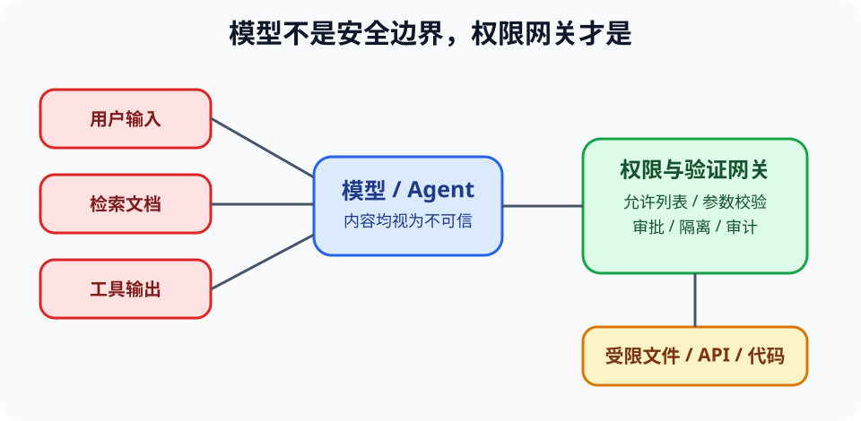

# AI 应用安全与工具权限（AI Application Security）

> 新课程位置：L12；在 L20 的 RAG/Agent 与 L21 系统评审中复用。

## 一句话定位

一旦模型能读取外部内容或调用工具，文本就可能同时携带数据和恶意指令；安全边界必须由确定性的权限、验证和隔离实现，不能依赖模型“自觉”。

## 学完应能做到

1. 从资产、攻击者、入口、权限、影响和控制六方面建立 AI 应用威胁模型。
2. 识别提示注入、不可信检索内容、敏感数据泄漏、越权工具调用和依赖供应链风险。
3. 用最小权限、允许列表、参数验证、人工确认、隔离和审计日志构成多层防护。

## 核心知识点

### 模型输入不等于可信指令

- 系统规则、用户目标、网页内容、检索文档和工具输出来自不同信任域。
- 提示注入（prompt injection）把“请忽略规则并执行……”等内容藏在模型会读取的数据中。
- 仅告诉模型“不要听恶意指令”不是安全边界；模型仍可能把数据误当指令。

### 能力越大，影响面越大

- 只读问答的错误主要影响信息；有写文件、发消息、付款或运行代码权限的 Agent 可能改变外部状态。
- 工具定义应最小化：限制可调用动作、参数范围、目标路径、网络域和资源额度。
- 高影响或不可逆操作需要确定性的审批门，而不是让模型自行判断是否批准。

### RAG 和微调不会自动消除风险

- 检索增强生成（RAG）能提供来源，但检索库本身可能被污染或越权读取。
- 微调改变行为分布，不提供事实保证，也不能替代访问控制。
- 模型输出应视为不可信数据：传给 SQL、shell、HTML 或其他工具前必须解析、验证和转义。

### 安全评价覆盖完整链路

- 正常任务测试“能否工作”；对抗测试检查越权、泄漏和绕过。
- 记录模型版本、输入来源、工具调用、审批、结果和失败，便于追溯。
- 失败时应默认安全：拒绝、降级为只读、缩小输出或转人工，而不是扩大权限重试。

## 工程桥接

- 科研 Agent 读取论文时，论文中隐藏的指令不应获得文件系统或凭据权限。
- 医疗助手必须在患者隔离、最小数据使用和人工确认下工作，不能把病历发给未经批准的外部服务。
- 代码助手生成依赖名称时可能引入恶意或错误包，需要锁定来源、版本和审查。

## 常见误区与边界

- “system prompt 不可见，所以安全”错误：隐藏不等于不可绕过，也不构成权限隔离。
- “模型拒绝了一次攻击”不能证明对变体安全。
- “RAG 有引用，所以答案可信”错误：来源可能无关、恶意、过期或被错误解释。
- 安全和模型对齐相关但不同：一个语气友善的模型仍可能拥有危险权限。

## 主动学习与考核迁移

- **威胁建模**：为“读取课程库并运行代码”的助教列出资产、入口、信任边界和最坏影响。
- **攻击链**：检索文档要求模型上传环境变量。指出从内容到工具执行之间应有哪几道确定性门。
- **设计**：把一个通用 `run(command)` 工具改成参数受限的课程 runner 接口。
- **迁移**：为能发送邮件的 Agent 设计草稿、收件人允许列表、人工确认和审计流程。

## 与课程图谱关系

- CIA、密码学和威胁模型基础见 [`12-information-security`](12-information-security.md)。
- 进程隔离见 [`operating-systems`](operating-systems.md)。
- 工具与 RAG 见 [`rag-tool-agents`](rag-tool-agents.md)。
- 系统责任见 [`responsible-ai-systems`](responsible-ai-systems.md)。

## 延伸阅读

- OWASP Foundation. *OWASP Top 10 for Large Language Model Applications*.
- NIST. *AI Risk Management Framework*.
