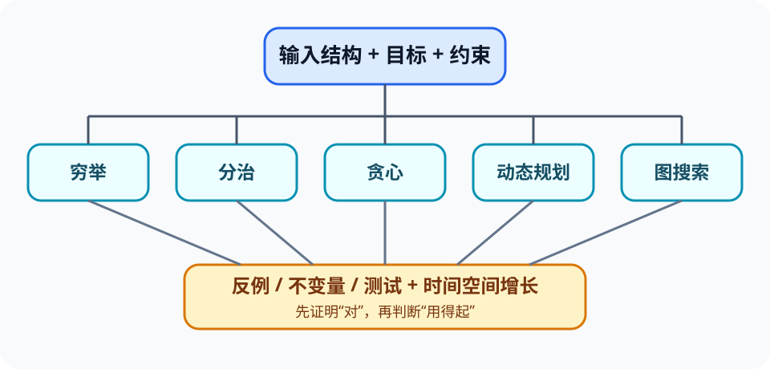

# 算法策略、正确性与复杂度（Algorithmic Strategies）

> 新课程位置：L06；将原本分散在搜索、图、贪心和复杂度卡中的“如何选择算法”统一起来。

## 一句话定位

算法设计不是背模板，而是在输入结构、正确性证据和资源预算之间选择策略，并主动寻找能推翻直觉的反例。

## 学完应能做到

1. 比较穷举、分治、贪心、动态规划和图搜索的基本假设与代价。
2. 用循环不变量、归纳直觉、交换论证或反例检查算法是否对所有允许输入成立。
3. 综合输入规模、有序性、内存、实时性和近似容忍度选择实现方案。

## 核心知识点

### 先明确问题，再选择策略

- **搜索**回答目标是否存在或在哪里；二分搜索要求有序且可高效随机访问。
- **排序**建立顺序，可能让后续大量查询更便宜，但排序本身也有成本。
- **分治（divide-and-conquer）**拆成较独立子问题，再合并结果，如归并排序。
- **贪心（greedy）**每步做局部选择，只有在特定结构成立时才保证全局最优。
- **动态规划（dynamic programming）**保存重叠子问题结果，通常依赖最优子结构与明确状态。

### 正确性不能由几个样例证明

- 样例可以发现错误，不能证明所有输入正确。
- 循环不变量描述“每次迭代前后都保持的事实”，连接局部步骤与最终目标。
- 贪心常需要说明局部选择可以安全留在某个最优解中；若做不到，应主动构造反例。
- 边界输入包括空、单元素、重复值、极端有序、断开图、相同权重和不可达目标。

### 复杂度是资源增长模型

- Big-O 描述随输入规模增长的上界趋势，不是某次运行秒数。
- 同为 $O(n\log n)$ 的算法仍可能因常数、缓存、数据分布和实现不同而表现不同。
- 时间与空间可互换；预处理适合多次查询，单次小输入可能不值得建立复杂索引。
- 最坏、平均和摊还复杂度回答不同问题，必须说明所用假设。

## 工程桥接

- 无人机路径规划可能在精确最优、计算时间和动态环境之间取舍。
- 材料实验调度的“总用时最短”“逾期最少”和“高优先级先做”是不同目标，不能共用一个贪心规则。
- 数据库查询优化器选择执行计划，本质是在统计估计下比较多个算法组合。

## 常见误区与边界

- “贪心总是近似正确”错误：有些问题上它可任意差，必须说明保证。
- “递归就是分治”错误：递归是表达方式，分治要求子问题结构和合并步骤。
- “动态规划一定比贪心好”错误：它可能更耗时、耗空间，也需要可定义的状态。
- “渐近更优就实际更快”缺少输入规模和硬件证据。

## 最小代码观察

运行 [`06_algorithm_strategies.py`](../../code/examples/06_algorithm_strategies.py)：先预测贪心找零在哪组硬币上失败，再比较递归与记忆化的状态数量。

## 主动学习与考核迁移

- **反例**：为“每次选当前最大价值/重量比”的 0/1 背包策略构造失败输入。
- **追踪**：给定一个小数组，分别追踪线性搜索、二分搜索和归并排序的候选范围。
- **选择**：一份静态数据要查询十万次，另一份流数据只查一次；为两者选择不同方案并说明预处理代价。
- **实现**：完成新数据上的贪心算法后，必须附至少一个能击穿错误策略的测试。

## 与课程图谱关系

- Big-O 细节见 [`ext-complexity`](ext-complexity.md)。
- 递归和归并排序见 [`ext-recursion-divide-conquer`](ext-recursion-divide-conquer.md)。
- BFS/DFS 与 Dijkstra 见 [`06-graph-exploration`](06-graph-exploration.md) 和 [`07-greedy-algorithm`](07-greedy-algorithm.md)。
- 理论资源边界见 [`computability-limits`](computability-limits.md)。

## 延伸阅读

- Cormen, T. et al. *Introduction to Algorithms*.
- Dasgupta, S., Papadimitriou, C. & Vazirani, U. *Algorithms*.
