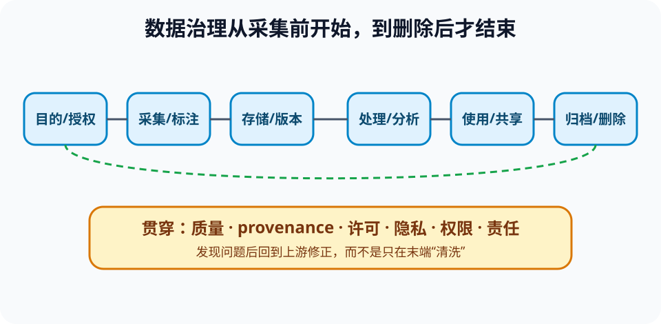

# 数据生命周期、来源与治理（Data Lifecycle and Governance）

> 新课程位置：L14；把“拿到数据后清洗”扩展为从采集前目的到最终删除的责任链。

## 一句话定位

数据不是凭空出现的中性原料；采集对象、测量方法、缺失机制、标注规则、访问权限和后续处理共同决定它能支持什么结论。

## 学完应能做到

1. 为数据集绘制目的、采集、存储、清洗、标注、使用、共享、归档与删除流程。
2. 区分缺失、噪声、重复、标签错误、选择偏差、数据泄漏和分布漂移。
3. 记录来源（provenance）、许可、版本、处理步骤、访问责任和使用限制。

## 核心知识点

### 先问目的与边界

- 为何收集、服务谁、不能用于什么，应在采集前明确。
- 数据最小化要求只收集完成目的所需内容；“以后也许有用”不是无限保留的充分理由。
- 同意、授权、合法性与研究伦理不是删除姓名后自动满足。

### 数据质量不是单一分数

| 维度 | 要问的问题 |
|---|---|
| 准确性 | 值与被测对象有多接近？ |
| 完整性 | 缺失是否系统性集中于某些对象？ |
| 一致性 | 单位、编码和定义在来源间是否一致？ |
| 时效性 | 数据是否仍代表当前环境？ |
| 代表性 | 样本是否覆盖目标人群和条件？ |
| 可追溯性 | 能否定位原始来源和每次变换？ |

### 来源记录连接原始数据与结论

- 保存数据版本、采集设备/协议、处理脚本、参数和变换顺序。
- 派生数据应能指回上游版本，避免“final_v2_new.csv”式不可审计命名。
- 修复错误时创建新版本并记录影响，而不是静默覆盖历史结果。

### 治理定义谁能做什么

- 数据所有者、管理者、处理者、使用者和审核者承担不同责任。
- 权限按角色和目的最小化，访问应有期限与日志。
- 删除必须考虑缓存、备份、派生数据和已训练模型，不能只删一个表格文件。

## 工程桥接

- 跨医院数据即使去标识化，也可能因稀有组合和外部信息重新识别。
- 传感器更换会改变数据分布；若不记录设备版本，模型漂移难以定位。
- 材料实验失败样本若被系统性丢弃，模型会高估成功率。

## 常见误区与边界

- “数据越多越好”错误：低质量、越权或分布不匹配的数据会放大风险。
- “匿名化等于零隐私风险”错误：组合特征和外部数据可能重新识别。
- “清洗就是删除异常值”错误：异常可能是故障、稀有真实现象或采集错误，需追因。
- 治理不是只写文档；权限、版本、日志和删除流程必须可执行。

## 主动学习与考核迁移

- **审计**：给一份虚构数据说明书，找出目的、采样、缺失、许可、版本和删除方面的证据缺口。
- **诊断**：训练集含同一患者的多次记录，随机按行划分会造成什么泄漏？如何重划分？
- **迁移**：为船舶设备预测维护数据建立从传感器到模型监控的来源链。
- **治理**：设计“研究结束两年后删除”的执行清单，覆盖派生表、备份和访问账户。

## 与课程图谱关系

- 结构化存储见 [`13-database`](13-database.md)。
- 清洗与模式发现见 [`14-data-mining`](14-data-mining.md)。
- 可重复记录见 [`reproducible-computing`](reproducible-computing.md)。
- 数据泄漏和漂移见 [`ml-evaluation`](ml-evaluation.md)。

## 延伸阅读

- Gebru, T. et al. (2021). Datasheets for Datasets. *Communications of the ACM*.
- NIST. *Privacy Framework*.
