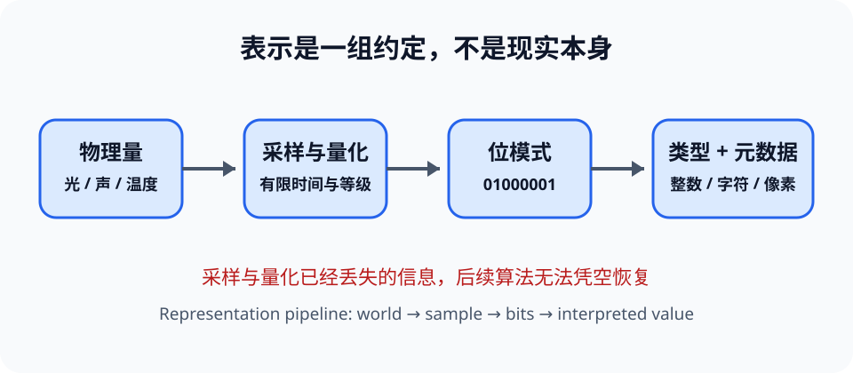

# 数据表示与编码（Data Representation and Encoding）

> 新课程位置：L02；在 L08 硬件和 L19 多模态中复用。讲稿只提供来源锚点，本卡按概念独立组织。

## 一句话定位

计算机只保存有限长度的位（bit）；整数、文字、图像和声音之所以有意义，是因为人们约定了**如何解释同一串位**。

## 学完应能做到

1. 在二进制、十六进制和常用存储单位之间转换，并说明位数如何限制范围。
2. 解释整数、浮点数、Unicode、像素与声音采样分别保留和舍弃了什么信息。
3. 根据异常现象区分溢出、舍入、精度损失、采样不足和压缩损失。

## 核心知识点

### 位模式没有天然含义

- `01000001` 可以按无符号整数解释为 65，也可以按 ASCII 解释为字符 `A`。
- **编码（encoding）**规定信息到位模式的映射；**解码（decoding）**按相同规则恢复解释。
- 元数据同样重要：尺寸、颜色空间、采样率、字节序或字符编码缺失时，位流可能无法正确解释。

### 整数：范围与溢出

- $n$ 位无符号整数能表示 $0$ 到 $2^n-1$。
- 常见有符号整数使用二进制补码（two's complement）；最高位参与权重，不只是独立的“负号位”。
- 固定位宽运算超过范围会溢出；不同语言可能回绕、报错或自动扩展，不能凭直觉假设。

### 浮点数：有限精度近似

- 浮点数近似为“符号 × 有效数字 × 指数”，用有限位数换取很大的动态范围。
- 很多十进制小数在二进制中是无限循环，因此 `0.1` 通常只能近似存储。
- 比较测量或计算结果时，应使用与问题尺度相称的容差，而不是默认严格相等。

### 文本、图像与声音

- Unicode 定义字符的码点；UTF-8 等编码把码点变成字节。字符数、码点数和字节数不总相等。
- 数字图像由像素网格、通道和位深组成；分辨率提高空间采样，位深提高可区分的强度等级。
- 数字声音把连续波形按采样率和量化精度离散化；采样不足可能产生混叠（aliasing）。
- 无损压缩保留可精确恢复的信息；有损压缩主动舍弃被认为不重要的细节。

## 工程桥接

- 医学影像的位深、窗宽窗位和压缩方式会改变可见细节，但文件更大不自动意味着诊断更可靠。
- 传感器数据从电压到 ADC 数值经历采样和量化；后续模型无法恢复采集阶段已经丢失的信息。
- 模型输入中的文字、图像和声音最终都成为张量，但不同模态的采样假设和误差来源不同。

## 常见误区与边界

- “二进制值就是数据的真实值”错误：位模式必须结合类型、单位和编码解释。
- “浮点误差说明计算机算错了”错误：它通常是表示集合有限，需要分析误差是否影响结论。
- “像素越多越清晰”不完整：光学系统、噪声、量化、压缩和显示都会成为瓶颈。
- 本卡只建立表示直觉；IEEE 754 特殊值和信号处理推导属于后续课程。

## 最小代码观察

运行 [`02_data_representation.py`](../../code/examples/02_data_representation.py)，先预测浮点比较、8 位回绕和 UTF-8 字节长度，再解释每个结果来自哪条表示规则。

## 主动学习与考核迁移

- **诊断**：同样的 8 位 `11111111` 按无符号整数和补码整数分别是什么？
- **追踪**：把一个 0–1 的测量值量化到 2 位，列出区间、码字和最大可能量化误差。
- **迁移**：某振动传感器分类效果差。请分别从采样率、位深、噪声、单位和模型五层提出可验证假设。
- **反思**：用两句话解释“上下文更长或模型更大为何不能找回未采集的信息”。

## 与课程图谱关系

- 前置逻辑见 [`ext-logic-boolean`](ext-logic-boolean.md)。
- 数值稳定与复现见 [`ext-scientific-computing`](ext-scientific-computing.md) 和 [`reproducible-computing`](reproducible-computing.md)。
- 位模式如何进入 CPU 和存储层次见 [`computer-architecture`](computer-architecture.md)。
- 多模态张量与结构偏置见 [`multimodal-models`](multimodal-models.md)。

## 延伸阅读

- IEEE. *IEEE Standard for Floating-Point Arithmetic (IEEE 754)*.
- Unicode Consortium. *The Unicode Standard: Encoding Forms*.
- Bryant, R. E. & O'Hallaron, D. R. *Computer Systems: A Programmer's Perspective*.
