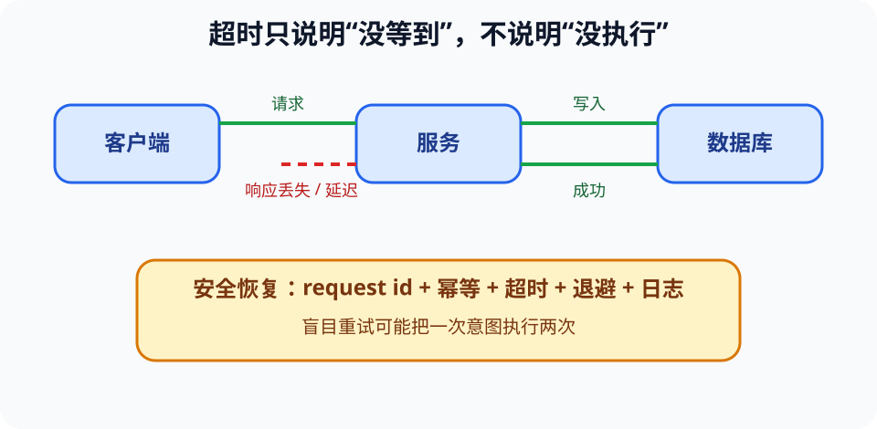

# 分布式系统、云服务与失败处理（Distributed Systems）

> 新课程位置：L10；在 L20 的远程模型与工具调用中复用。

## 一句话定位

当一个任务跨越多台机器和网络时，任何节点都只看到局部状态；“没有收到响应”无法区分请求未到、服务未做、响应丢失或只是更慢。

## 学完应能做到

1. 追踪客户端、网络、服务和存储之间的一次请求，并标出部分失败点。
2. 为读操作和有副作用操作分别设计超时、重试、请求标识与幂等策略。
3. 解释复制带来的可用性、延迟、一致性和成本权衡。

## 核心知识点

### 网络把失败变得含糊

- 单机函数返回或抛错，调用者通常知道控制流结果；远程调用可能只有“超时”。
- 超时是调用者停止等待的策略，不证明服务端没有执行。
- 网络会延迟、丢失、重复或重排消息；系统必须决定如何检测和恢复。

### 重试需要幂等

- 幂等（idempotent）表示同一操作执行多次与一次的目标效果相同。
- 查询通常容易重试；“扣款”“提交实验任务”可能产生重复副作用。
- 请求唯一标识、去重记录和条件更新可以让重复请求安全收敛。
- 退避（backoff）和抖动（jitter）减少大量客户端同时重试造成的雪崩。

### 复制、一致性与可用性

- 副本提高容错和读吞吐，但更新传播需要时间与协调。
- 强一致更容易给出单一最新视图，通常付出更多延迟或降低故障时可用性。
- 最终一致允许短暂旧值，适合能容忍延迟收敛的场景。
- 事务、共识和 CAP 有严格条件；导论阶段重点是识别权衡，不背口号。

### 可观察性是恢复基础

- 日志记录事件，指标汇总趋势，追踪（trace）连接跨服务请求。
- 请求 id、时间、版本和结果状态应贯穿链路，避免只看到最后一层报错。
- 云不是“不会坏的别人的电脑”，而是通过自动化和冗余管理故障的资源池。

## 工程桥接

- 上传医学影像后客户端超时，盲目重试可能生成两份检查记录。
- 远程 LLM 工具调用返回慢时，Agent 需要区分可重试查询与不可重复的写操作。
- 多地实验数据副本必须记录版本和来源，否则“最新”可能因观察节点而异。

## 常见误区与边界

- “TCP 可靠，所以应用不会重复”错误：应用超时后的重试仍可能重复业务操作。
- “加副本只提高可靠性”不完整：它也增加一致性、成本和运维复杂度。
- “超时越短越好”错误：过短会把正常慢请求判为失败并放大负载。
- 本卡不推导共识算法，只要求能分析故障和语义。

## 最小代码观察

运行 [`10_retry_idempotency.py`](../../code/examples/10_retry_idempotency.py)，比较没有请求 id 和使用请求 id 时重复提交的结果。

## 主动学习与考核迁移

- **时序**：客户端超时后重试，第一次响应后来到。画出可能的两次服务执行。
- **设计**：给“查询天气”“提交实验”“扣减库存”分别定义重试条件和幂等键。
- **权衡**：设备告警状态与社交点赞数，哪一个更需要强一致？说明错误代价。
- **迁移**：为调用远程 AI 模型的服务设计请求 id、超时、退避、日志和人工降级。

## 与课程图谱关系

- 分层与 HTTP 见 [`11-computer-network`](11-computer-network.md) 和 [`ext-web-technologies`](ext-web-technologies.md)。
- 本机并发见 [`operating-systems`](operating-systems.md)。
- 数据事务见 [`13-database`](13-database.md)。
- Agent 工具链见 [`rag-tool-agents`](rag-tool-agents.md)。

## 延伸阅读

- Kleppmann, M. *Designing Data-Intensive Applications*.
- Tanenbaum, A. & van Steen, M. *Distributed Systems*.
