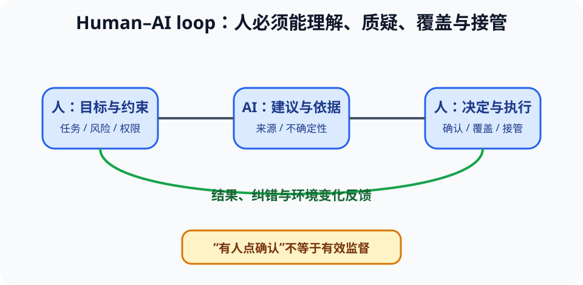

# 人机交互、无障碍与校准信任（HCI and Accessibility）

> 新课程位置：L16；将数据“呈现正确”扩展为人能理解、操作、质疑和接管系统。

## 一句话定位

系统是否好用取决于用户能否形成正确心智模型、看见状态、预测后果、从错误恢复；AI 界面还必须让信任与真实能力相匹配。

## 学完应能做到

1. 用可发现性、反馈、一致性、映射、约束和错误恢复诊断交互问题。
2. 使用键盘可达、颜色之外编码、文本替代、清晰标签和足够对比度改进无障碍。
3. 为 AI 建议设计依据、置信边界、人工确认、纠错和接管机制。

## 核心知识点

### 设计围绕人的任务，而非功能列表

- 先明确用户、目标、环境、频率、时间压力和错误后果。
- 可发现性让用户知道能做什么；反馈让用户知道系统刚做了什么。
- 一致性降低学习成本；约束防止无效或危险操作；撤销帮助从错误恢复。

### 认知负荷与信息层级

- 工作记忆有限，界面应把相关信息组合，避免同时展示所有细节。
- 默认视图支持常见任务，必要时渐进披露高级信息。
- 红色不能是唯一告警编码；应结合文字、图形或声音，并避免制造告警疲劳。

### 无障碍是基本质量

- 所有关键操作应可由键盘完成，焦点顺序与视觉顺序一致。
- 图像和图表提供有意义的文本说明；表单标签与错误提示可被辅助技术识别。
- 使用足够对比度，不只依赖颜色区分类别；动画应允许减少或暂停。
- 无障碍改进通常也帮助临时受限、强光、噪声或高压力环境中的所有用户。

### AI 需要校准信任

- 过度信任导致自动化偏见，完全不信任则浪费有用能力。
- 界面应说明建议依据、适用范围和不确定性，允许查看来源与纠错。
- 高风险决策不能只加一个“人工确认”按钮；人必须有时间、信息和权限真正审查。
- 系统应记录何时、为何接受或覆盖 AI 建议，用于后续监测。

## 工程桥接

- 医疗告警界面需要让医生快速看到证据、时间趋势和异常来源，而非只显示一个风险分数。
- 设备控制台应支持戴手套、强光和噪声环境，不能依赖细小图标和颜色。
- 课程助教应引导学生先作答，避免对话界面把 AI 变成替代思考的答案按钮。

## 常见误区与边界

- “用户培训一下就好”不能掩盖界面缺少反馈和防错。
- “无障碍只服务少数人”错误：情境性和临时性限制很常见。
- “解释越多越透明”错误：信息过载会降低理解，应按任务分层呈现。
- “human in the loop”不是万能免责条款；必须验证人是否能有效接管。

## 主动学习与考核迁移

- **诊断**：找一个无法确认是否提交成功的界面，指出缺失反馈及重复提交风险。
- **无障碍**：将只用红/绿表示状态的图改为颜色、文字和形状三重编码。
- **测试**：让同伴在不接受口头提示下完成任务，记录首次犹豫、错误和恢复路径。
- **迁移**：为 AI 医疗建议设计“摘要—依据—不确定性—人工决定—复盘”界面流程。

## 与课程图谱关系

- 视觉编码见 [`15-data-visualization`](15-data-visualization.md)。
- 不确定性解释见 [`probability-uncertainty`](probability-uncertainty.md)。
- Agent 交互见 [`rag-tool-agents`](rag-tool-agents.md)。
- 人本责任见 [`responsible-ai-systems`](responsible-ai-systems.md)。

## 延伸阅读

- Norman, D. *The Design of Everyday Things*.
- W3C. *Web Content Accessibility Guidelines (WCAG)*.
