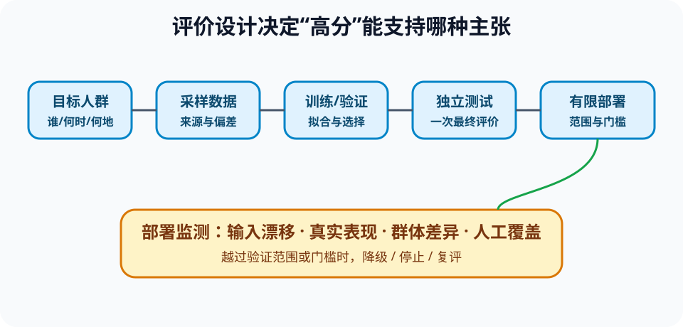

# 机器学习泛化、评价、偏差与漂移（ML Generalization and Evaluation）

> 新课程位置：L18；把“训练一个模型”转化为“证明它对目标环境有足够证据”。

## 一句话定位

机器学习的核心不是记住训练数据，而是在未见、但与目标环境相关的数据上保持有用表现；评价设计决定我们能否发现自欺。

## 学完应能做到

1. 根据患者、设备、时间或地点等独立单位划分训练、验证和测试数据，识别泄漏。
2. 根据类别基率、错误代价和使用场景选择指标与阈值。
3. 区分数据偏差、模型偏差、群体差异、校准问题和部署后分布漂移。

## 核心知识点

### 泛化与数据划分

- 训练集用于拟合参数，验证集用于选择模型和阈值，测试集只用于最终独立评价。
- 反复查看测试结果并调参，会把测试集变成隐性验证集。
- 同一患者、样品或设备的相近记录跨集合出现，会让模型利用对象身份或重复信号。
- 时间外推、地点外推与随机同分布划分回答不同问题。

### 过拟合与基线

- 训练误差持续下降、验证误差恶化是典型过拟合信号。
- 正则化、简化模型、更多代表性数据和早停可减少过拟合，但不修复错误标签或目标定义。
- 应与简单基线比较：多数类、线性模型、领域规则或上一版系统。

### 指标、阈值与校准

- 分类分数需要阈值转成行动；改变阈值会在假阳性和假阴性间移动。
- ROC-AUC、PR-AUC、F1、灵敏度和特异度强调不同性质，不能脱离基率与代价选指标。
- 校准关注“预测 0.8 的样本是否约 80% 为正”；区分排序能力与概率可解释性。
- 回归任务还需检查误差分布、异常值和不同范围的系统偏差。

### 群体偏差与漂移

- 总体平均值可能掩盖某些群体、设备或场景表现很差。
- 公平指标之间可能冲突，必须结合任务、权利和错误后果说明选择。
- 协变量、标签关系、基率或数据流程变化都会造成漂移。
- 部署后需要监测输入、输出、延迟、缺失、反馈和真实结果，并设降级门槛。

## 工程桥接

- 设备故障模型在同一台机器的随机片段上表现好，不证明能泛化到新机器。
- 医学模型应按患者划分，并检查不同年龄、性别、医院和设备群体。
- 推荐系统离线点击率提升可能带来内容同质化，需要长期和系统级指标。

## 常见误区与边界

- “测试集准确率高”不自动支持真实部署。
- “交叉验证消除所有偏差”错误：它仍继承数据采样和划分假设。
- “公平就是所有群体准确率相同”过度简化：错误类型、基率和影响也重要。
- “检测到漂移就重训”可能把错误或攻击数据纳入训练，应先诊断来源。

## 最小代码观察

运行 [`18_model_evaluation.py`](../../code/examples/18_model_evaluation.py)，比较随机按行划分与按对象划分时的结果差异，并解释哪一种更接近目标部署问题。

## 主动学习与考核迁移

- **泄漏诊断**：同一患者的多次检查跨训练/测试，模型可能学到什么捷径？
- **指标选择**：筛查、垃圾邮件和设备停机三个任务分别更怕哪类错误？阈值应如何调整？
- **群体审查**：总体 90% 准确率、某关键群体 62%，是否部署？还需要哪些证据？
- **漂移设计**：列出输入、性能、反馈延迟与人工覆盖四类监测信号。

## 与课程图谱关系

- 条件概率和混淆矩阵见 [`probability-uncertainty`](probability-uncertainty.md)。
- 数据来源见 [`data-lifecycle-governance`](data-lifecycle-governance.md)。
- 学习范式见 [`17-machine-learning`](17-machine-learning.md)。
- 部署门槛见 [`responsible-ai-systems`](responsible-ai-systems.md)。

## 延伸阅读

- Hastie, T., Tibshirani, R. & Friedman, J. *The Elements of Statistical Learning*.
- Sculley, D. et al. (2015). Hidden Technical Debt in Machine Learning Systems. *NeurIPS*.
