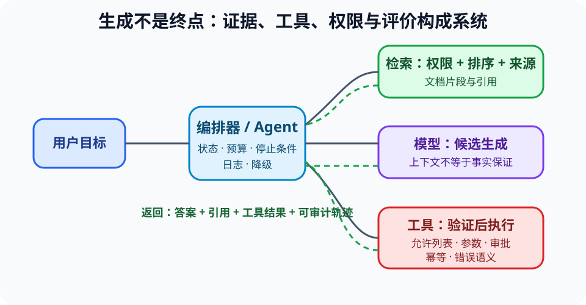

# RAG、工具调用与生成式 Agent（RAG, Tools and Agents）

> 新课程位置：L20；把“模型会回答”提升为可检索、可执行、可观察和可评价的系统。

## 一句话定位

LLM 负责生成候选语言；RAG 提供外部证据，工具执行确定性操作，Agent 编排多步决策——每增加一层能力，也增加新的失败与权限边界。

## 学完应能做到

1. 区分参数中学习的信息、当前上下文、外部检索结果和工具执行状态。
2. 追踪“查询改写—检索—排序—生成—引用—工具—反馈”的状态和失败点。
3. 为课程或工程 Agent 设计权限、来源核验、结构化接口、日志与可判分评价集。

## 核心知识点

### 四种能力来源

| 来源 | 擅长 | 主要边界 |
|---|---|---|
| 模型参数 | 通用模式与语言生成 | 不可直接追溯、可能过期或错误 |
| 上下文 | 当前任务规则和材料 | 容量有限，内容也可能不可信 |
| 检索 | 找到外部文档片段 | 召回、排序、权限与来源质量 |
| 工具 | 计算、查询或改变状态 | 参数、权限、错误和副作用 |

长上下文只是容量，不保证模型读取了正确片段、进行了正确推理或遵守课程口径。

### RAG 是一条管线

- 文档切分和索引决定可被检索的单元。
- 查询改写影响召回；向量相似不等于事实相关或权限允许。
- 排序选择送入上下文的证据；生成应绑定引用并允许回到原文核验。
- 评价至少分开检索命中、引用支持、答案正确和拒答质量。

### 工具调用需要结构化契约

- 工具应有明确名称、参数类型、允许值、错误语义和副作用。
- 模型产生的是调用建议，系统必须验证后再执行。
- 读操作与写操作的授权不同；高影响写操作需要人工确认和幂等设计。
- 工具结果也可能失败、超时、过期或包含恶意内容，应作为不可信输入继续处理。

### Agent 是状态机，不是魔法人格

- Agent 保存目标、观察、计划、工具结果和停止条件。
- 循环必须有步数、时间、预算和权限上限，失败时能降级或转人工。
- 多 Agent 增加通信和协调开销；没有证据时不应假设“讨论”自然提高正确率。
- 可观察性记录每步依据，便于定位是检索、模型、工具还是系统编排错误。

## 工程桥接

- 课程助教应先从知识索引取卡，再按学习目标提问；模型补充必须标记，不能冒充课程资料。
- 科研 RAG 必须保留论文、版本、页段和检索日期，避免只输出不可核查摘要。
- 自动实验 Agent 的工具应限制设备、参数范围和危险组合，并保留人工急停。

## 常见误区与边界

- “接上向量数据库就没有幻觉”错误：检索和生成都可能失败。
- “引用存在就支持答案”错误：必须检查引用是否真正蕴含对应主张。
- “工具返回成功，所以目标完成”错误：需要验证外部状态与用户意图。
- “Agent 越自主越先进”忽略风险、成本和可恢复性。

## 最小代码观察

运行 [`20_rag_pipeline.py`](../../code/examples/20_rag_pipeline.py)。它使用小型本地词项检索和带引用回答，故意避免把真实模型调用隐藏在示例里；先为查询写期望命中文档，再运行。

## 主动学习与考核迁移

- **追踪**：给定三个文档、查询和工具结果，标出每一步状态与证据来源。
- **评价**：编写 6 条小型评价集，覆盖正常命中、无答案、冲突来源、越权文档、工具失败和注入内容。
- **安全**：把通用 shell 工具改成白名单课程 runner，说明减少了哪些攻击面。
- **迁移**：设计医学文献助手的拒答、引用、时间边界和人工复核流程。

## 与课程图谱关系

- LLM 原理见 [`21-llm`](21-llm.md)。
- Web/API 与故障见 [`ext-web-technologies`](ext-web-technologies.md) 和 [`distributed-systems`](distributed-systems.md)。
- 安全边界见 [`ai-security`](ai-security.md)。
- 人机交互与责任见 [`hci-accessibility`](hci-accessibility.md) 和 [`responsible-ai-systems`](responsible-ai-systems.md)。

## 延伸阅读

- Lewis, P. et al. (2020). Retrieval-Augmented Generation for Knowledge-Intensive NLP Tasks. *NeurIPS*.
- NIST. *AI Risk Management Framework*.
