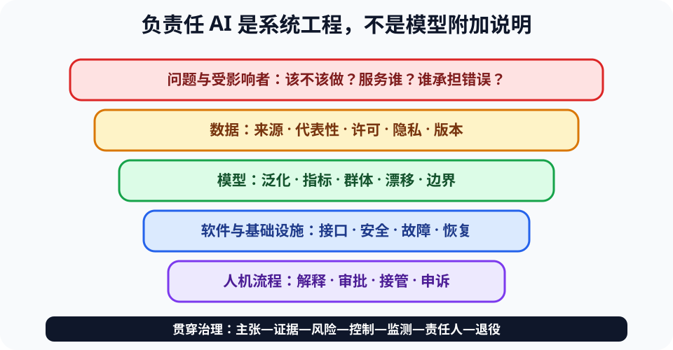

# 负责任 AI 系统工程与综合评审（Responsible AI Systems）

> 新课程位置：L21；本卡不是一组伦理口号，而是把四大思维转成可审查的系统证据。

## 一句话定位

负责任 AI 不是给模型加免责声明，而是在需求、数据、模型、软件、基础设施、人机流程和治理各层明确主张、证据、风险、控制、监测与责任人。

## 学完应能做到

1. 用计算、系统、数据和智能四种思维对 AI+ 工程方案做端到端审查。
2. 为关键主张建立“证据—风险—控制—残余风险”链，而不是只展示模型 demo。
3. 定义不部署、限制使用、降级、人工接管、停止和事故复盘条件，并分配责任。

## 核心知识点

### 从问题正当性开始

- 要解决的问题是否真实，AI 是否比规则、流程改进或非自动化方案更合适？
- 谁获得收益，谁承担错误、监控或隐私成本？受影响者是否参与需求定义？
- 成功指标必须包含真实任务结果和伤害约束，不能只用模型准确率或使用次数。

### 四大思维联合评审

| 支柱 | 关键问题 |
|---|---|
| 计算思维 | 问题如何表示？算法边界、复杂度和不可验证部分是什么？ |
| 系统思维 | 依赖、接口、权限、故障、攻击与恢复如何传播？ |
| 数据思维 | 数据从哪里来、代表谁、能支持什么结论、如何治理？ |
| 智能思维 | 模型怎样泛化、如何评价、何时漂移、人怎样监督？ |

### 主张—证据—风险—控制

- 主张应具体，如“在目标医院成年门诊数据上，敏感度至少 90%”，而非“模型很准确”。
- 证据必须直接支持主张，并说明版本、样本、指标和不确定性。
- 风险同时考虑发生可能性、影响、暴露人群、可检测性和可恢复性。
- 控制优先消除或限制风险，再考虑告警和免责声明；记录仍然存在的残余风险。

### 人类监督与问责

- 人工复核者必须有领域能力、足够时间、可理解证据和覆盖模型的真实权限。
- 明确数据、模型、软件、运营、安全和最终决策的责任主体。
- 用户申诉、错误纠正、事件上报和停止机制应在部署前建立。
- 监测发现超出验证范围、关键群体退化或安全事件时，应按预设门槛降级或停止。

### 生命周期而非一次评审

- 上线前做需求、数据、模型、安全和可用性验证。
- 上线后监测分布、表现、群体差异、人工覆盖、事故和资源消耗。
- 版本变化需要重新评价；退役时处理数据、模型、权限、文档和依赖。

## 工程桥接

- 医疗模型若只对某设备验证，应限制适用范围并在设备变化时触发复评。
- 材料生成模型提出候选配方后，安全约束和物理实验仍决定能否执行。
- 船海或航空系统必须设计通信中断、传感器故障和模型失效时的确定性降级。

## 常见误区与边界

- “伦理原则写进文档就负责”错误：原则必须落实为角色、门槛和可测试控制。
- “有 human in the loop 就安全”错误：无信息、无时间或无权限的人只是形式按钮。
- “开源模型所以透明”错误：训练数据、运行环境、系统集成和真实行为仍可能不透明。
- “模型不保存数据所以无隐私风险”错误：日志、提示、检索库和工具链都可能泄漏。

## 主动学习与考核迁移

- **综合表**：为一个 AI+ 项目填写至少四条“主张—证据—风险—控制—责任人”。
- **反方评审**：分别扮演用户、安全负责人、领域专家和运营人员提出失败场景。
- **部署门槛**：写出三个必须停止或降级的可观察条件，不能只写“效果不好”。
- **开卷迁移**：面对全新案例，至少引用四大支柱各一个概念，并连接成故障/证据链。

## 与课程图谱关系

- 自动化边界见 [`computability-limits`](computability-limits.md)。
- 证据与版本见 [`reproducible-computing`](reproducible-computing.md)。
- 数据治理、模型评价、安全和 HCI 分别见 [`data-lifecycle-governance`](data-lifecycle-governance.md)、[`ml-evaluation`](ml-evaluation.md)、[`ai-security`](ai-security.md)、[`hci-accessibility`](hci-accessibility.md)。

## 延伸阅读

- NIST. *AI Risk Management Framework*.
- UNESCO. *Recommendation on the Ethics of Artificial Intelligence*.
- ISO/IEC 42001. *Artificial Intelligence Management System*.
