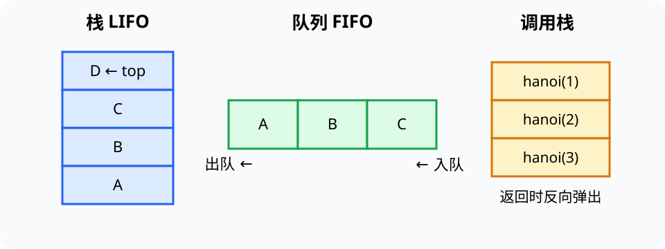

# 栈、队列与状态边界（Stack, Queue and State Boundaries）

> 新课程位置：L04；调用栈在 L05、调度队列在 L09 复用。

## 一句话定位

栈和队列不只是容器，而是对“下一个允许访问谁”施加纪律：栈后进先出（LIFO），队列先进先出（FIFO）。

## 学完应能做到

1. 对一串 `push/pop` 或 `enqueue/dequeue` 操作画出每一步状态。
2. 根据撤销、括号匹配、等待服务和图遍历等场景选择栈或队列。
3. 识别空结构访问、容量上限、循环队列下标与顺序公平性的边界。

## 核心知识点

### 抽象数据类型先于实现

- 栈提供 `push`、`pop`、`top`；队列提供 `enqueue`、`dequeue`、`front`。
- 接口规定可观察行为，数组、链表或环形缓冲区只是实现选择。
- Python `list.pop(0)` 会移动后续元素；大量队首操作更适合 `collections.deque`。

### 不变量是追踪钥匙

- 栈顶永远是最近尚未移除的元素。
- 普通队列的队首永远是最早尚未服务的元素。
- 循环队列复用数组空间，需要明确 `head`、`tail` 和“空/满”的判定约定。

### 状态纪律决定算法行为

- 表达式求值、浏览器后退和函数调用使用栈保存未完成的上下文。
- BFS 使用队列按距离层次扩展；DFS 可使用显式栈或递归调用栈。
- 操作系统就绪队列体现调度策略；“队列”不保证所有系统都严格先来先服务。

## 工程桥接

- 急诊分诊不能简单使用 FIFO：优先级与等待时间需要结合，通常引出优先队列。
- 实时数据采集使用有限缓冲区时，必须明确“满了丢新数据、丢旧数据还是阻塞生产者”。
- 航班或实验任务的撤销/重做通常需要两个栈，而不是一个历史列表。

## 常见误区与边界

- “栈只能用数组实现”错误：抽象行为与物理存储应分开。
- “队列天然公平”错误：优先级、抢占、取消和资源需求会改变实际顺序。
- `pop` 的返回元素与删除后状态都要追踪；只写最终序列容易漏掉中间错误。
- 栈和队列解决访问顺序，不解决元素如何快速按键查找；后者见哈希表。

## 最小代码观察

- 运行 [`05_structures.py`](../../code/examples/05_structures.py)。
- 用 [`stack_expr.html`](../../code/visualizations/stack_expr.html) 和 [`circular_queue.html`](../../code/visualizations/circular_queue.html) 逐步预测下一状态。

## 主动学习与考核迁移

- **追踪**：空栈依次执行 `push(A), push(B), pop(), push(C), top()`，记录每一步及返回值。
- **纠错**：给循环队列的 `head/tail` 更新代码设计“恰好绕回数组首端”的测试。
- **迁移**：为传感器生产速度偶尔高于处理速度的系统设计缓冲策略，并解释丢弃或阻塞的代价。
- **实现**：完成 `lab-01-structures` 后，用一个从未在 starter 出现的操作序列验证边界。

## 与课程图谱关系

- 线性存储见 [`04-data-structure-basics`](04-data-structure-basics.md)。
- 递归调用栈见 [`ext-recursion-divide-conquer`](ext-recursion-divide-conquer.md)。
- BFS/DFS 见 [`06-graph-exploration`](06-graph-exploration.md)。
- 调度与并发见 [`operating-systems`](operating-systems.md)。

## 延伸阅读

- Cormen, T. et al. *Introduction to Algorithms*, Elementary Data Structures.
- Python Documentation. *collections.deque*.
